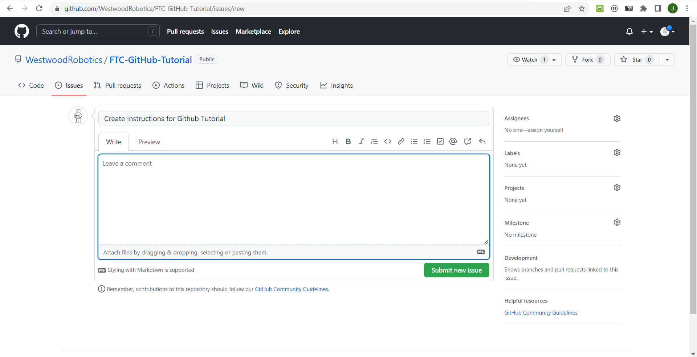
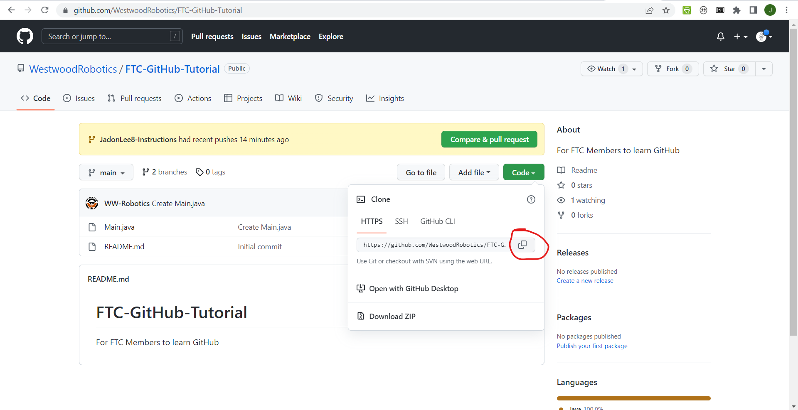
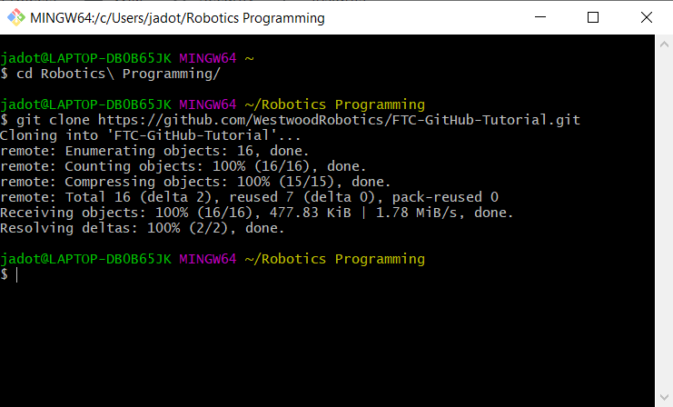
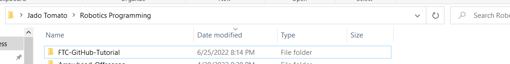

# FTC-GitHub-Tutorial
For FTC Members to learn GitHub

## Getting Started
If you're not already added to the Westwood Robotics Github organization, please fill out the google form [here](https://docs.google.com/forms/d/e/1FAIpQLSem02o6UWvw7SDrx79-wWmDvUgLiNIrVyI_i_1ZKi8lNNkPrA/).

Look through the features in this Github Tutorial and devise a simple one that you think would be useful (ex: telemetry, getting controller input, controlling the drive, etc...). Please try to keep your feature addition small. Try to use multiple commits throughout the development of your feature.

Once you've identified a useful feature, create an issue. Feel free to create multiple issues if you find other things that you believe should be implemented, but make sure to only assign yourself to one. 

Great, now that you've got an issue to work on (feel free to use issues already created by others but not assigned to anyone), lets clone this repository onto your computer.

This is what we call a remote reposotory since it's remotely accesable by everyone. In order to open files locally on your device, you will have to copy this repository onto your computer. When you make commits and changes to commits, they affect this local reposotory. It is not until you push the commits made locally to the remote reposotory that everyone can view and access them.
The first thing we will have to do is [download Git Bash](https://git-scm.com/downloads), because it allows us to interact with our reposotories and copy the remote one locally. 

After you've downloaded git bash, copy the reposotory link.

Use "cd [file directory name]" to navigate towards your desired folder where you would like to store this local reposotory.
Then type "git clone [resposotory link]" into git bash like so.

Now that you've cloned the repo, try nnavigating to the folder that you cloned it to to see if it worked!

