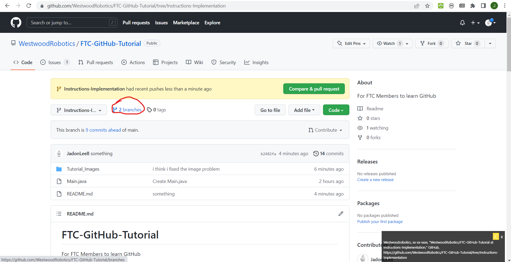
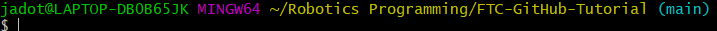

# FTC-GitHub-Tutorial
For FTC Members to learn GitHub

## Forking
Before we get started with this, be sure to fork the project. Forking essentially makes a new remote repo that's identical to the one being copied, but has no linkeges to it (unlike cloning, which creates a local repo that is connected to the remote one).

Make sure to follow all of the following steps on your own forked repo.

## Getting Started
If you're not already added to the Westwood Robotics Github organization, please fill out the google form [here](https://docs.google.com/forms/d/e/1FAIpQLSem02o6UWvw7SDrx79-wWmDvUgLiNIrVyI_i_1ZKi8lNNkPrA/).

Devise a simple one that you think would be useful (ex: telemetry, getting controller input, controlling the drive, etc...). Try to use multiple commits throughout the development of your feature.

Once you've identified a useful feature, create an issue. Feel free to create multiple issues if you find other things that you believe should be implemented. Assign yourself to one or more issues. 

Great, now that you've got an issue to work on (feel free to use issues already created by others but not assigned to anyone), lets clone this repository onto your computer.

This is what we call a remote reposotory since it's remotely accesable by everyone. In order to open files locally on your device, you will have to copy this repository onto your computer. When you make commits and changes to commits, they affect this local reposotory. It is not until you push the commits made locally to the remote reposotory that everyone can view and access them.
The first thing we will have to do is [download Git Bash](https://git-scm.com/downloads), because it allows us to interact with our reposotories and copy the remote one locally. 

After you've downloaded git bash, copy the reposotory link.

Use "cd [file directory name]" to navigate towards your desired folder where you would like to store this local reposotory.
Then type "git clone [resposotory link]" into git bash like so.

Now that you've cloned the repo, try nnavigating to the folder that you cloned it to to see if it worked!

Now that we've successfuly cloned the project (let a consultant know if something didn't work), lets create a branch for your feature implementation.
First go to the branches tab and create a new branch. If you are creating a sub-branch, be sure to adjust the branch dource accordingly.

Since you've just created a new branch in your remote reposotory (there is a way to do it locally, but it's slightly more complicated. ask a consultant if your interested), you will need to pull.
A pull is executed with the command "git pull" and is used to update your local repo to match the remote one. In this case we need to update it in accordance to our newly created branch, but it's good practice to pull before working on code every time, since there is always a possibility that someone else made changes to the code which you are about to edit, something that can cause problems. 

One thing to be careful of is to make sure that you are working on the right branch. If you go to Bash, your command line probably looks like this.

Notice the blue parenthesis. Whatever is between these indicates which branch you are working on. 
In order to change branches, use "git checkout [branch name]".
You should see the branch name in the blue parenthesis change (contact a consultant if it doesn't).

Whenever working on your project, always always always make sure that you are on the right branch, since changes made on the wrong branch will... well they'll be commited to the wrong branch, creating an annoying mess.

