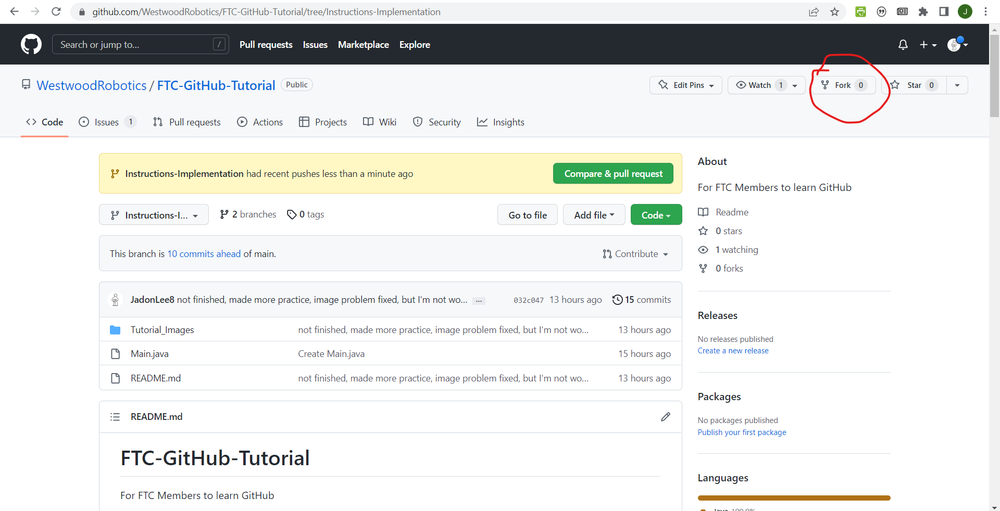
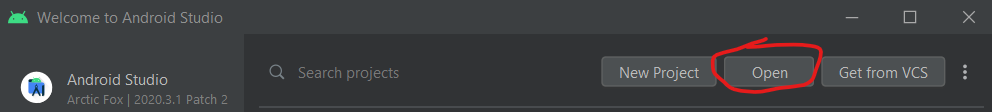
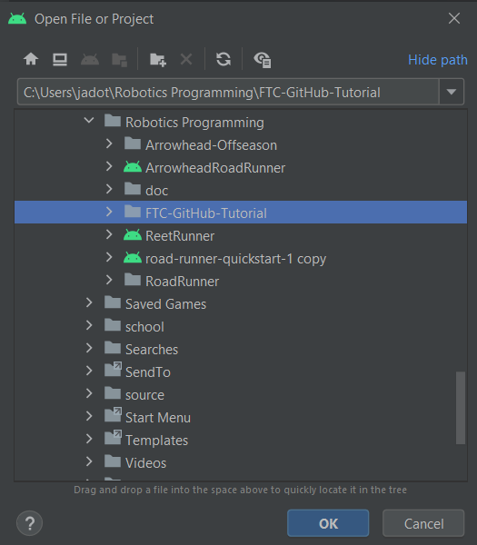
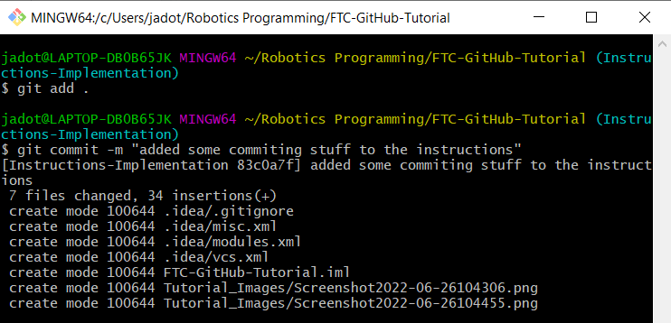
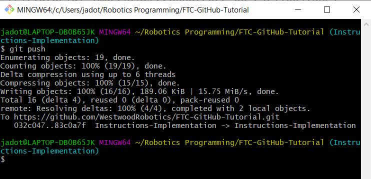
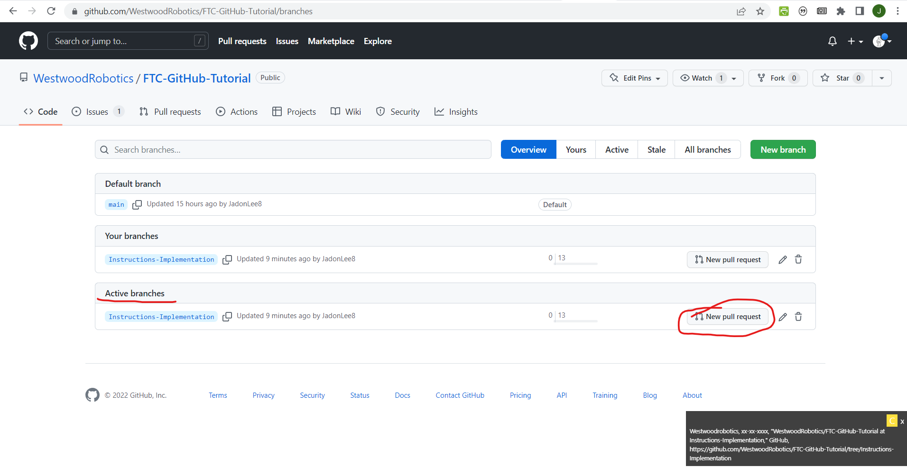
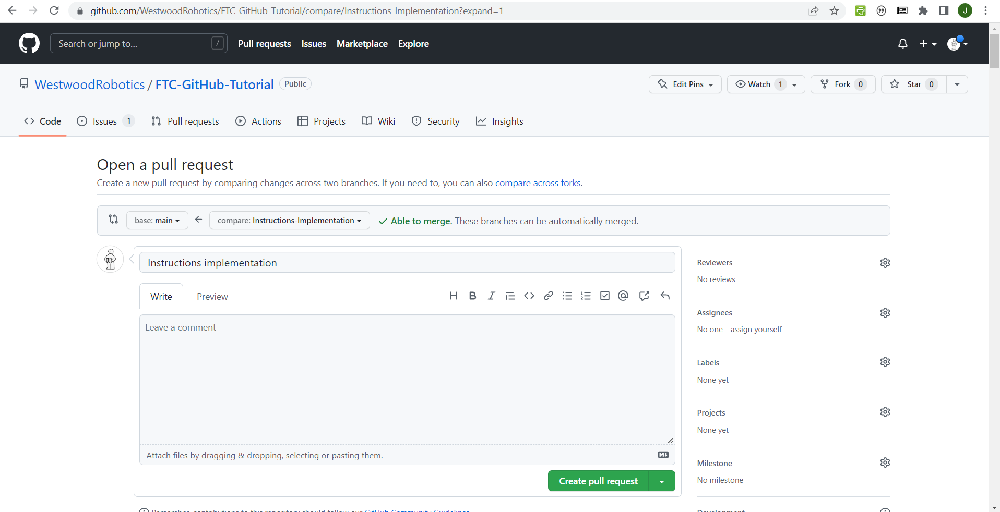

# FTC-GitHub-Tutorial
For FTC Members to learn GitHub

## Forking
Before we get started with this, be sure to fork the project. Forking essentially makes a new remote repo that's identical to the one being copied, but has no linkeges to it (unlike cloning, which creates a local repo that is connected to the remote one).

Make sure to follow all of the following steps on your own forked repo.

## Getting Started
If you're not already added to the Westwood Robotics Github organization, please fill out the google form [here](https://docs.google.com/forms/d/e/1FAIpQLSem02o6UWvw7SDrx79-wWmDvUgLiNIrVyI_i_1ZKi8lNNkPrA/).

Devise a simple feature that you think would be useful (ex: telemetry, getting controller input, controlling the drive, etc...). Try to use multiple commits throughout the development of your feature.

Once you've identified a useful feature, create an issue. Feel free to create multiple issues if you find other things that you believe should be implemented. Assign yourself to one or more issues. 

Great, now that you've got an issue to work on (feel free to use issues already created by others but not assigned to anyone), lets clone this repository onto your computer.

This is what we call a remote reposotory since it's remotely accesable by everyone. In order to open files locally on your device, you will have to copy this repository onto your computer. When you make commits and changes to commits, they affect this local reposotory. It is not until you push the commits made locally to the remote reposotory that everyone can view and access them.
The first thing we will have to do is [download Git Bash](https://git-scm.com/downloads), because it allows us to interact with our reposotories and copy the remote one locally. 

After you've downloaded git bash, copy the reposotory link.

Use "cd [file directory name]" to navigate towards your desired folder where you would like to store this local reposotory.
Then type "git clone [resposotory link]" into git bash like so.

Now that you've cloned the repo, try nnavigating to the folder that you cloned it to to see if it worked!

## Branching
Now that we've successfuly cloned the project (let a consultant know if something didn't work), lets create a branch for your feature implementation.
First go to the branches tab and create a new branch. If you are creating a sub-branch, be sure to adjust the branch dource accordingly.

Since you've just created a new branch in your remote reposotory (there is a way to do it locally, but it's slightly more complicated. ask a consultant if your interested), you will need to pull.
A pull is executed with the command "git pull" and is used to update your local repo to match the remote one. In this case we need to update it in accordance to our newly created branch, but it's good practice to pull before working on code every time, since there is always a possibility that someone else made changes to the code which you are about to edit, something that can cause problems. 

One thing to be careful of is to make sure that you are working on the right branch. If you go to Bash, your command line probably looks like this.

Notice the blue parenthesis. Whatever is between these indicates which branch you are working on. 
In order to change branches, use "git checkout [branch name]".
You should see the branch name in the blue parenthesis change (contact a consultant if it doesn't).

Whenever working on your project, always always always make sure that you are on the right branch, since changes made on the wrong branch will... well they'll be commited to the wrong branch, creating an annoying mess.

## Actually Writing Code!!
So everything is set up now, we are on the right branch, and it is time to start writing code. Use Android Studio (see [Android Studio Tutorial](https://docs.google.com/presentation/d/1iUlxjcrxuyIZWXUFMNzPuYlr5EJXidzRTllLaZ7bxXQ/edit?usp=sharing)) to open up your project (if Android Studio is not working, you may use anothher IDE of your choice, but we highly recommend Android Studio since it is what we use in FTC). 

Once again, if you are not familar with Android Studio, see our Android Studio Tutorial. 

When familiar with navigating Android Studio, create and delete files, write and delete code, and work on your feature. For every step you take in writing your implementation (not necessarily every carachter, but more like every method or two), be sure to commit using either the built in commit feature in Android Studio or using Git Bash after saving your work in Android Studio with ctrl+s. 
To commit with Git Bash, save your work in Android Studio and open Git Bash (make sure your working on the right branch). Use "cd" to navigate to your project folder in bash, then type "git add .". What this will do is add all of your changes (the dot signifies all, but you can specify exactly what you want to change too) to the current staged commit (a commit that hasn't been commited yet).
If your satisfied with your commit, use "git commit" to create a commit. Bash will prompt you to add a commit message in a new screen which can be configured using "git config". If your bash settings are default, type a short but detailed commit message, then hit esc, followed by typing ":wq" and pressing enter.
The secondary message screen can be avoid by using the command "git commit -m"[insert message]"", which allows you to commit and add a comment in one command. 

Now that you have made one or more commits to your local reposotory, you should push it to your remote one once you have an internet connection.
This can be done with the command "git push". 

Now you remote and local reposotories match up. One error you might run into when working with a team is when your code being pushed conflicts with the current code. Say person 1 is working on the same branch as person 2. Person 2 pushes some code in the morning that deletes a method. Person 1 forgets to pull before they work on their code and decides to modify the method deleted by person 2 earlier because they do not know that person 2 actually deleted it. When person 1 attempts to push the code to the remote repo in the afternoon, there is a conflict between the two versions. You would be prompted with a configurable screen that will show you the conflict and allow you to decide which change should be kept. This is why you should ALWAYS pull before working and be careful when two people are working on the same branch. 

Continue working on your feature until completion. 

## Merging
After you feel your feature is completed, it is time to merge. If you missed the Github and Git introductory lesson, check it out [here](https://docs.google.com/presentation/d/1YNw5FzJAP8Ln8anP9AH8PgZl_0VgL0Oua4a5Fj6u760/edit?usp=sharing). This presentation goes over the idea behind merges.
In an typical setting, you would need to create a pull request in Github and have someone with permission (typically a consultant or experience programmer or Git Specialist) verify that the code works and should be merged into main. If this person thinks it should be merged into main, they will authorize the pull request and boom, your code is now part of the main code.
For this learning setting, however, you will get to authorize the pull request yourself since it is your project!

I should probably begin this section on merging by giving a brief on what a pull request is. It is essentially a request to have your code combined with the main code using one of three merges that were gone over in the Github presentation.

But if you feel ready then you can start by pushing your code to make sure that the remote repo where you will be doing this merge is up to date. 
Next you will log into Github and open up your repo's page. Head to the branches page and click create new pull request for the branch that is completed under active branches.

You can leave a comment if you feel it is necessary. If the repository is set up so that a certain number of people must review your work before the merge can be completed, the "request reviewers" feature on the right hand side of the screen can prove to be quite useful.

For this learning environment, however, you will authorize the pull request yourself.
ADD IMAGE LATER

Merges become troublesome when there are conflicts between the changes in the source branch and your branch. Just like when pushing, you will be able to go through and decide which changes take precendence. 

Another thing you should do is link the issue to the pull request you just made and resolve the issue once the pull request is authorized.
INSERT IMAGE LATER

