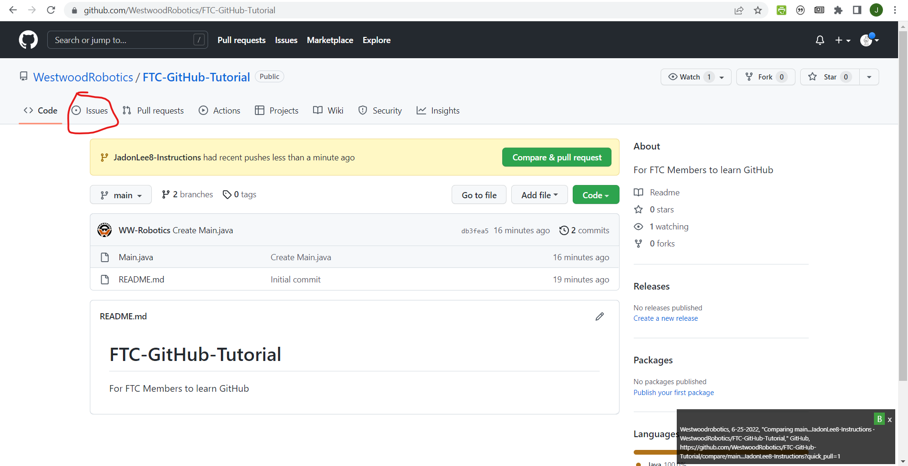

# FTC-GitHub-Tutorial
For FTC Members to learn GitHub

## Getting Started
If you're not already added to the Westwood Robotics Github organization, please fill out the google form [here](https://docs.google.com/forms/d/e/1FAIpQLSem02o6UWvw7SDrx79-wWmDvUgLiNIrVyI_i_1ZKi8lNNkPrA/).

Look through the features in this Github Tutorial and devise a simple one that you think would be useful (ex: telemetry, getting controller input, controlling the drive, etc...). Please try to keep your feature addition small. Try to use multiple commits throughout the development of your feature.

Once you've identified a useful feature, create an issue. Feel free to create multiple issues if you find other things that you believe should be implemented, but make sure to only assign yourself to one. 

